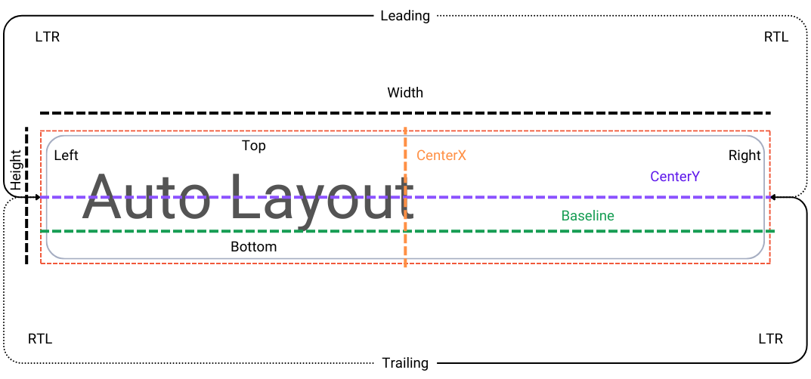
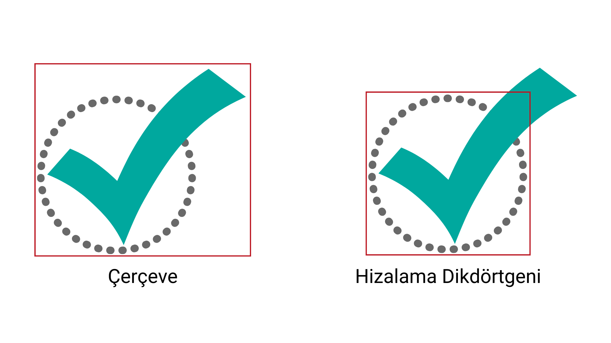

#  Otomatik Yerleşim (Auto Layout)

Uygulama tasarımında mutlak koordinatlar belirtmek, ekranın boyutunu önceden bildiğimizi varsayar ve oluşturduğumuz yerleşim düzenini kırılgan hale getirir. Auto Layout ile görünümlerin düzenini, çerçevelerin çalışma zamanında belirlenmesini sağlayan göreceli bir şekilde tanımlayabiliriz. Böylece çerçevelerin tanımları, uygulamanın üzerinde çalıştığı cihazın ekran boyutunu dikkate alabilir.

Otomatik Yerleşim sistemi hizalama dikdörtgenini temel alır. Hizalama dikdörtgenini tanımlayan özellikler aşağıdaki görselde gösterilmiştir.

Bu görselde bir görünümün hizalama dikdörtgenini tanımlayan yerleşim özellikleri gösterilmiştir. Genel olarak width (genişlik), height (yükseklik), top (üst), left (sol), bottom (alt), right (sağ), centerX (yatay düzlemde orta nokta) ve centerY (düşey düzlemde orta nokta) niteliklerini biliyoruz.
Önemli niteliklerden biri de temel hat olarak Türkçe'ye çevirebileceğimiz baseline özelliğidir. FirstBaseline ve LastBaseline nitelikleri hizalama dikdörtgeninin taban çizgilerini belirler. Baseline birçok görünüm için aslında bottom niteliği ile aynıdır. Ancak bazı istisna durumlar vardır. Örneğin görseldeki gibi bir textfield niteliğinde baseline, metni oluşturan harflerin alt çizgileri hizasından tanımlanır. Bu sayede "y", "g", "p" gibi harflerin alta doğru uzayan kısımlarının başka bir görünüm tarafından gizlenmesi önlenir.
Leading (başlangıç) ve trailing (bitiş) nitelikleri, uygulamanın kullandığı dile göre değişebilir. Soldan sağa doğru okunan Türkçe, İngilizce gibi dillerde leading, left yani sol; trailing ise right yani sağ ile aynı değere sahiptir. Sağdan sola doğru okunan Arapça gibi dillerde ise durum tam tersidir.
Otomatik yerleşim ayarlaması yaparken left/right yerine leading/trailing kullanmak daha doğru bir yaklaşımdır.

Hizalama dikdörtgeninin:
- Boyutunu ayarlamak için width ve height niteliklerini kullanırız.
- Başka bir görünüm ile hizalayabilmek için top, left, bottom ve right niteliklerini kullanırız.
- Merkez noktalarını anlayabilmek için centerX ve centerY niteliklerini kullanırız.
Varsayılan olarak, her görünümün bir hizalama dikdörtgeni vardır ve her görünüm hiyerarşisi Otomatik Düzen kullanır. Yani interface builder kullanarak ekrana eklediğimiz bir nesne hizalama dikdörtgenine sahip olarak görünür. Hizalama dikdörtgeni çerçeveye çok benzer. Aslında, bu iki dikdörtgen genellikle aynıdır. Çerçeve tüm görünümü kapsarken, hizalama dikdörtgeni yalnızca hizalama amacıyla kullanmak istediğiniz içeriği kapsar.
    
 

