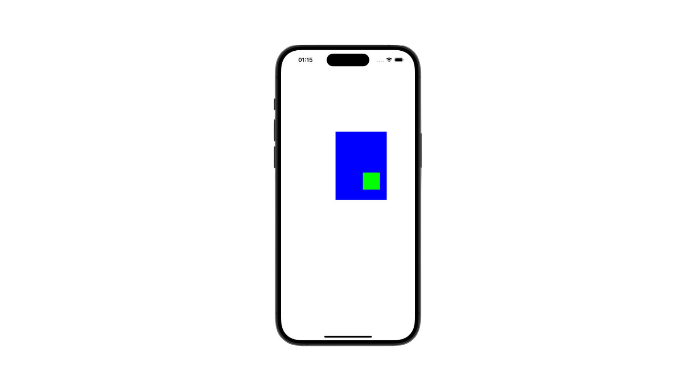

# iOS Auto Layout System

## Views (Görünüm) Yapısı

Bir uygulamanın kullanıcı arayüzünü görünüm nesneleri (view objects) olarak adlandırdığımız button, textfield, slider, label vs. gibi nesneler oluşturur. Bir görünüm (view):
- UIView veya alt sınıflarından birinin örneğidir.
- Kendini nasıl çizeceğini bilir.
- Dokunma gibi olayları işleyebilir. 
- Bir hiyerarşi içerisinde bulunur. Bu hiyerarşinin kökü uygulama penceresi olarak düşünülebilir.

## Görünüm Hiyerarşisi

Her uygulama, içindeki tüm nesneleri kapsayan tek bir UIWindow örneğine sahiptir. UIWindow, UIView'in bir alt sınıfıdır. O nedenle pencereninin kendisi de bir görünümdür. Uygulama başlatıldığında pencere oluşturulur. Daha sonra yeni görünümler eklenebilir. Pencereye yeni bir görünüm eklendiğinde artık eklenen görünüm pencerenin alt görünümü olur. Bu sayede hiyerarşi oluşur.


## Görünümler ve Çerçeveler
Bir görünümü interface builder yerine kodla başlattığımızda **init(frame:)** olarak belirlenen başlatıcısını kullanmamız gerekir. Bu yöntem UIView sınıfının bir özelliği olan görünümün çerçevesi olacak **CGRect** argümanı alır.

```swift
var frame: CGRect
````
Bir görünümün çerçevesi, görünümün boyutunu ve üst görünüme göre konumunu belirtir. Bir görünümün boyutu her zaman çerçevesi tarafından belirlendiğinden, bir görünüm her zaman bir dikdörtgendir.

```swift
import UIKit

class ViewController: UIViewController {

    override func viewDidLoad() {
        super.viewDidLoad()
        
        let firstFrame = CGRect(x: 160, y: 240, width: 150, height: 200)
        let firstView = UIView(frame: firstFrame)
        firstView.backgroundColor = .blue
        view.addSubview(firstView)
        
        let secondFrame = CGRect(x: 80, y: 120, width: 50, height: 50)
        let secondView = UIView(frame: secondFrame)
        secondView.backgroundColor = .gr
        view.addSubview(secondView)
    }
}
```

Yukarıdaki kod ile Interface Builder yerine doğrudan kod yazarak iki farklı çerçeve oluşturduk. Bu çerçevelerin içine birer dikdörtgen tanımladık. CGRect fonksiyonunu kullanarak oluşturduğumuz dikdörtgenlerin pencerede hangi konumda yer alacağını ve boyutlarını belirttik. Ardından, UIView sınıfından bir görünüm oluşturup, çerçeveleri frame: argümanına atadık. Son olarak, bu görünümleri ana görünüm (ViewController) içine alt görünümler olarak ekledik. Son durumda, görünüm hiyerarşisi aşağıdaki gibi olacaktır.


Simülatör görüntüsü ise aşağıdaki gibi olur.


Kodda küçük bir güncelleme yaparak *secondView* görünümünü ama görünüm yerine *firstView*'in alt görünümü yaptığımızda hiyerarşi de ona gör değişecektir.

```swift
firstView.addSubview(secondView)
```


Simülatör görüntüsü ise aşağıdaki gibi olur.



Burada dikkat etmemiz gereken nokta ikinci görünümün (*secondView*) konumunu belirlerken referans olarak hiyerarşide bir üstünde bulunan görünümü dikkat almasıdır.
